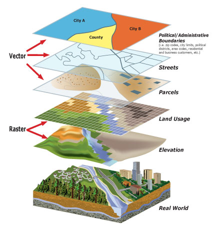

# Introduction to Geospatial Data with Python

Data comes in all shapes and sizes and often government data is geospatial in nature. Often times data science programs & tutorials ignore how to work with this rich data to make room for more advanced topics. Our MinneMUDAC competition heavily utilized geospatial data but was processed to provide students a more familiar format. But as good scientists, we should use primary sources of information as often as possible.

Use this Notebook to get a basic understanding of how to read, write, query and perform simple geospatial calculations on Minnesota Tax shapefiles, MetCouncil Water Features and MN PCA Lake Quality Attributes with Python.

* Open the .ipynb file with Jupyter Notebook to get started!
